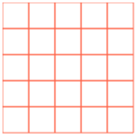
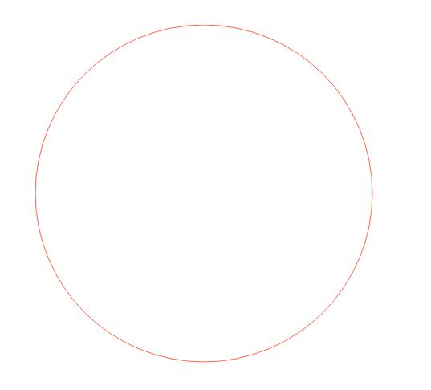
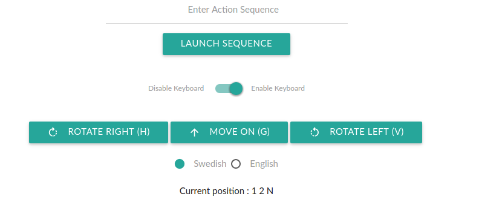

# SmartRobot - Introduction

SmartRobot is a application made for a programming assignment with backbone.js. This program will allow user to control a robot on a grid. The robot can :

- Turn left or right, and can therefore face the cardinal points
- Move forward inside the room.

The robot will have a starting point, given by the user or set at his initialization.

There are two types of rooms :

- Squared room (initialized with a width and a height): The coordinates 0:0 represent the top left of the room
- Rounded room (initialized with a radius): The coordnates 0:0 represent the center of the room

# How it works ?

## When we open the index page

We have two choices, create a squared room or a rounded room :


## The squared room

To initialize a squared room, we need to create the object from the SquaredRoom model :

```javascript
var room = new SquaredRoom({
    height: 5, // The room will have 5 blocks as height
    width: 5 // The room will have 5 blocks as width
});
```

The room has been created, but at this point, you have to use your imagination to see the room because nothing is drawn on the page. If you are having troubles using your imagination, don't worry, I have made a roomView to see what we are doing ! Simply create the roomView with this line :

```javascript
var roomView = new RoomView({
    model: room,
});
```

You have noticed that for the roomView object, I set the 'room object' parameter. This way the roomView can be drawn :



## The rounded room

The process to create a rounded room is quite the same except that we only need a radius value :

```javascript
var room = new RoundedRoom({
    radius: 7, // The room will have 5 blocks as height
});
```

The rounded room is drawn using the same roomView. So the method is exactly identical as before. After the initialization of the roomView, we can see the rounded room (a simple circle that can surely be improved) :



## The robot !

We can initialize a robot using this expression :

```javascript
var robot = new Robot({
    xValue: 1, // add x value for abciss position
    yValue: 2, // add y value for ordinate position
    language: Languages.swe, // add a default language to the robot
    room: room // add the room so the robot will know where he is and can interact
});
```

By default, the robot is always facing the North direction :

```javascript
        compassValue: 'N', // direction where the robot is looking
```

The robot needs some information to move correctly :

- The room where he belongs
- He's language (Swedish or English)
- The coordinates where he should start inside the room

Like for the room, there is a RobotView which draw the robot inside the room :

```javascript
var robotView = new RobotView({
    model: robot
});
```


You can see the direction where the robot is looking (where he's blinking)

## Control the robot !

Every controls are managed by the views. If something has to be changed for the room or the robot object, the view will transmit the information to the model.

Here are all the interactions for a robot :



- Add action sequence : Enter an action sequence like 'HGGVG' and click the button 'launch sequence'. The robot will then execute the sequence
- Disable / enable keyboard : This is just to disable keyboard shortcut in case we want to enter an action sequence but we don't want the robot to move while we type
- 3 actions : Rotate right, move on and rotate left, all associated with keyboard shortcuts
- A choice between Swedish or English can be made
- The current position is the coordinates and the facing direction of the robot
- On the bottom right of the screen, a 'refresh' button is present

# Running tests with jasmine.js
12 tests have been created, two of them have been taked from the specification of the programming assignement :

Test 1:
>We set up with a square room on 5 x 5 squares and Start Position (1,2)<br/>Then gives instructions "HGHGGHGHG" performance report:"1 3 N '

Test 2:
>We set up with a circular area with RADIUS 10 boxes and the origin of the circle Center, <br/>and starting Position (0,0). In addition, we configure the robot into English.<br/>Then give instructions "RRFLFFLRF" performance report: "3 1 E"

To run all these tests, simply open the file SpecRunner.html everthing should be fine here I guess.

# Technical choices

- **Backbone.js** (<http://backbonejs.org/>) as my MV framework - Easy Key bindings and Event-driven communication are the main reason of my choice. I found the documentation really helpful.
- **Materialize** (<http://materializecss.com/>) as the CSS Framework
- **Atom** (<https://atom.io/>) as my Text Editor
- **GitKraken** (<https://www.gitkraken.com/>) to manage my git repo locally
- **Git Flow** (<http://danielkummer.github.io/git-flow-cheatsheet/>) as my right-hand best tool to manage repository operations
- **Jasmine.js** to make sure everything is working as expected by running tests
