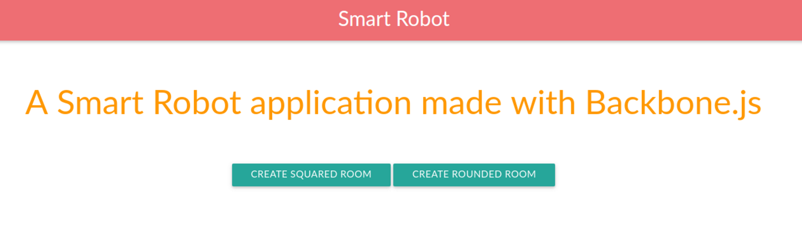
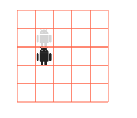

## SmartRobot

SmartRobot is a application made with backbone.js.
This program will allow user to control a robot on a grid.
The robot can :
- Turn left or right, and can therefore face the cardinal points
- Move forward on the grid.

The robot will have a starting point, given by the user or set at the initialization of the application.

## Screenshots
### On first start
We have two choices, create a squared room or a rounded room :

### The robot inside squared room
When the squared room is initialized (with the given parameters), the robot is automatically placed on the 

## Technical choices
- **Backbone.js** (http://backbonejs.org/) as my MV framework - Easy Key bindings and Event-driven communication are the main reason of my choice
- **Materialize** (<http://materializecss.com/>) as the CSS Framework
- **Atom** (<https://atom.io/>) as my Text Editor
- **GitKraken** (<https://www.gitkraken.com/>) to manage my git repo locally
- **Git Flow** (<http://danielkummer.github.io/git-flow-cheatsheet/>) as my right-hand best tool to manage repository operations
